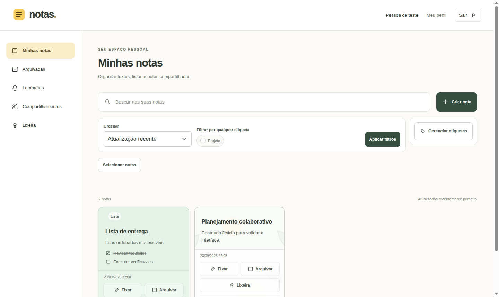

# Notas

[](https://github.com/MatheusRyuki/notas-laravel/actions/workflows/qualidade.yml)

Aplicativo de notas desenvolvido como projeto de estudo em Laravel. Organize textos e listas, compartilhe notas e continue escrevendo mesmo sem conexão.

A interface está em português, com Blade, Alpine.js e Tailwind CSS. O visual e os fundos SVG são próprios, inspirados no Google Keep.



## Funcionalidades

- Notas de texto e listas de tarefas, com edição em modal.
- Fixação, cores, fundos locais, etiquetas pessoais e ordenação.
- Busca enquanto digita, incluindo itens de listas.
- Arquivo, lixeira, restauração e exclusão definitiva com confirmação.
- Ações em lote e opção de desfazer arquivamento ou envio à lixeira por cinco minutos.
- Cópia e download das notas em texto.
- Lembretes com notificações no aplicativo e e-mail opcional.
- Compartilhamento com permissões de leitura ou edição.
- Consulta, criação e edição offline, com sincronização e resolução de conflitos.
- Cadastro, login, recuperação de senha e atualização do perfil.

## Executar localmente

Você precisa de Git, Docker com Compose e internet para baixar as dependências. No Windows, use o Ubuntu no WSL2 com a integração do Docker Desktop habilitada. No Linux, use Docker Engine com Compose.

PHP, Composer e Node.js rodam em containers. Não é necessário instalá-los globalmente.

```bash
git clone https://github.com/MatheusRyuki/notas-laravel.git
cd notas-laravel
cp .env.example .env

docker run --rm \
  --user "$(id -u):$(id -g)" \
  -e COMPOSER_HOME=/tmp/composer \
  -v "$PWD":/app -w /app \
  composer:2.10 install --ignore-platform-reqs --no-scripts --no-interaction

./vendor/bin/sail up -d --build
./vendor/bin/sail composer install --no-interaction
./vendor/bin/sail composer check-platform-reqs
./vendor/bin/sail artisan key:generate
./vendor/bin/sail artisan migrate
./vendor/bin/sail npm ci
./vendor/bin/sail npm run build
```

Acesse [localhost:8004](http://localhost:8004) e crie sua conta.

O primeiro comando do Composer prepara o Sail. A instalação seguinte e a conferência dos requisitos usam o PHP 8.5 do container. Em instalações existentes, aplique novas migrations com `./vendor/bin/sail artisan migrate`, sem recriar o banco.

### Portas e serviços

| Serviço | Endereço local | Entre containers |
| --- | --- | --- |
| Aplicação | http://localhost:8004 | `laravel.test:80` |
| MySQL | `127.0.0.1:33061` | `mysql:3306` |
| Vite | http://localhost:5174 | `laravel.test:5174` |
| Mailpit | http://localhost:8026 | `mailpit:8025` |
| SMTP | Sem porta publicada | `mailpit:1025` |

Confira se as portas estão livres antes de iniciar. Os serviços são publicados apenas em `127.0.0.1`.

O projeto Compose se chama `notas`, usa a rede `notas-rede`, o volume `notas-mysql` e a imagem `notas-app:php85`. Banco e usuário MySQL se chamam `notas`. O cookie de sessão é `notas_session`.

### Comandos do dia a dia

```bash
./vendor/bin/sail up -d
./vendor/bin/sail ps
./vendor/bin/sail npm run dev
./vendor/bin/sail npm run build
./vendor/bin/sail down
```

Use `npm run dev` durante o desenvolvimento e `npm run build` para gerar os assets. Ao parar os serviços, use `down` sem `-v` para preservar os dados.

### Recuperação de senha e e-mails

Os e-mails ficam no [Mailpit local](http://localhost:8026). Para recuperar a senha, saia da conta, escolha **Esqueci minha senha** e informe o e-mail cadastrado. Abra a mensagem no Mailpit e use o link recebido. Ele expira em 60 minutos.

Os lembretes também usam o Mailpit. O envio para caixas de e-mail externas não está configurado.

## Como as notas funcionam

### Conteúdo e organização

Notas de texto aceitam título de até 255 caracteres e descrição de até 10.000. Pelo menos um desses campos precisa ter conteúdo. Espaços nas extremidades são removidos; quebras de linha da descrição são mantidas.

Uma lista tem de 1 a 100 itens, com até 500 caracteres por item. Você pode marcar a conclusão e reordenar pelos botões de subir e descer. O tipo da nota é escolhido na criação e não muda durante a edição.

Notas fixadas aparecem antes das demais. A ordenação pode ser por atualização, criação ou título, com ID como desempate. Na ordem alfabética, notas sem título ficam por último.

Etiquetas são pessoais, inclusive nas notas compartilhadas. Os nomes aceitam até 60 caracteres e são únicos por conta, sem diferenciar maiúsculas e minúsculas. Selecionar várias etiquetas encontra notas que tenham **qualquer uma** delas. Excluir uma etiqueta preserva as notas.

### Cores e fundos

A paleta tem Padrão, Areia, Menta, Céu, Lavanda e Pêssego. A galeria oferece quatro fundos locais: Folhas tranquilas, Ondas suaves, Formas serenas e Céu pontilhado. Não há upload de imagens.

A aparência escolhida no modal é uma prévia e só passa a valer ao salvar. Cancelar ou fechar mantém a aparência anterior. Escolher uma cor remove a imagem de fundo; Padrão restaura a aparência neutra.

O servidor aceita apenas identificadores do catálogo. Os campos e arquivos estão descritos no [modelo das notas](docs/modelo-nota.md).

### Arquivo, lixeira e desfazer

Arquivar retira a nota da tela principal e mantém conteúdo, aparência e fixação. A nota continua editável em **Arquivadas**. Ao desarquivar, volta ao grupo correspondente.

A lixeira permite consultar, restaurar ou excluir definitivamente. Restaurar recupera a mesma nota, com seu ID e estados anteriores: uma nota arquivada retorna a **Arquivadas**. Para editar uma nota removida, restaure-a primeiro.

A exclusão definitiva exige confirmação e não pode ser desfeita. Os fundos SVG são compartilhados e não são apagados com a nota. Não há exclusão automática por prazo nem opção de esvaziar toda a lixeira.

Arquivamento e envio à lixeira podem ser desfeitos por cinco minutos, desde que não exista uma alteração posterior que impeça a reversão. Cada operação pode ser desfeita uma vez. Ações em lote validam todas as notas: se alguma falhar, o lote inteiro é recusado.

### Busca e exportação

A busca considera título, descrição e itens de lista, incluindo os concluídos. Ela respeita a seção atual: **Minhas notas**, **Arquivadas** ou **Lixeira**.

O termo aceita até 100 caracteres e fica na URL para manter a consulta ao recarregar ou mudar de seção. Uma busca vazia restaura a listagem. Caracteres como `%` e `_` são tratados como texto.

A consulta acontece após uma pausa de 300 ms na digitação. Respostas antigas são descartadas, e a interface distingue carregamento, ausência de resultados e falha de comunicação. O formulário também funciona por envio convencional sem JavaScript.

Notas que você pode consultar também podem ser copiadas ou baixadas em `.txt` UTF-8. Listas usam `[x]` e `[ ]` para indicar conclusão. Se a cópia para a área de transferência falhar, o aplicativo recorre ao download.

### Lembretes

Cada conta pode ter um lembrete pessoal por nota acessível. O horário usa o fuso do perfil, inicialmente `America/Sao_Paulo`, e é armazenado em UTC.

Arquivar mantém o lembrete. Enviar a nota à lixeira o suspende; restaurar reativa apenas agendamentos futuros. Horários vencidos precisam ser reagendados. Revogar o acesso ou excluir definitivamente impede novos envios para aquela nota.

Os serviços `queue` e `scheduler` executam a fila e verificam os horários. O comando `lembretes:processar` roda a cada minuto. Para iniciar esses serviços separadamente:

```bash
./vendor/bin/sail up -d queue scheduler
```

### Compartilhamento

Os convites usam o e-mail de uma conta cadastrada. O acesso começa após a aceitação; não existe um diretório público de usuários.

| Papel | Permissões |
| --- | --- |
| Proprietário | Editar conteúdo e aparência, gerenciar participantes e todas as ações da nota |
| Editor | Consultar e editar título, descrição, itens e aparência |
| Leitor | Consultar, copiar e baixar |

Somente o proprietário pode fixar, arquivar, enviar à lixeira, restaurar ou excluir. Etiquetas e lembretes continuam pessoais. Na lixeira, uma nota compartilhada fica visível apenas para o proprietário.

O aplicativo compara revisões antes de salvar. Se outra pessoa já alterou a nota, apresenta um conflito para que você compare as versões e decida como continuar.

### Uso offline

Após o primeiro login com conexão, você pode consultar notas disponibilizadas no dispositivo, criar notas e editar conteúdo ou aparência offline. Compartilhamento, lembretes, etiquetas, ações em lote e operações destrutivas precisam de conexão.

As alterações pendentes são sincronizadas na reconexão. Repetir uma operação cuja resposta se perdeu não duplica a nota nem reaplica a alteração. Conflitos exigem uma decisão, e o servidor confere novamente as permissões antes de aceitar mudanças.

Os dados locais são separados por conta. Sair com alterações pendentes exige confirmação; a troca de conta remove os dados anteriores e informa quando pendências foram descartadas. Sair offline não encerra a sessão que ainda existe no servidor.

O armazenamento do navegador pode ser removido pelo usuário ou pelo sistema. Revogar o acesso não apaga imediatamente uma cópia em um dispositivo desconectado. O modo offline não substitui um backup.

## Segurança

O proprietário é definido pela sessão autenticada, e as permissões são verificadas no servidor. Enviar outro `usuario_id` não permite transferir a nota ou acessar dados de outra conta.

Os formulários usam proteção CSRF, e o conteúdo das notas é exibido como texto escapado. A busca respeita os filtros de acesso e seção. Caminhos de imagem e CSS arbitrários não são aceitos.

## Testes

```bash
./vendor/bin/sail artisan test
./vendor/bin/sail bin pint --test
./vendor/bin/sail composer validate --strict
./vendor/bin/sail composer check-platform-reqs
./vendor/bin/sail npm run build
```

O PHPUnit usa SQLite em memória. Para testes de navegador que criem contas ou alterem notas, use os ambientes descartáveis abaixo.

### Integração contínua

O workflow **Qualidade** executa em pushes para `main`, pull requests destinados a `main` e acionamento manual. Os jobs PHP e Frontend são independentes, em Ubuntu com PHP 8.5, Composer 2 e Node.js 24.

O job PHP executa `composer validate --strict`, `composer install`, `composer check-platform-reqs`, `php vendor/bin/pint --test` e `php vendor/bin/phpunit`. Ele também compila os assets com `npm ci` e `npm run build`, pois os testes renderizam views Blade que usam o manifest do Vite. O job Frontend verifica esses dois comandos separadamente.

Antes da suíte, um servidor temporário confirma por HTTP ambiente `testing`, SQLite `:memory:`, sessão/cache em `array` e ausência de configuração em cache. Fila síncrona e correio em `array` são conferidos no bootstrap do Laravel. Qualquer divergência interrompe a execução antes dos testes.

O CI não usa MySQL, credenciais pessoais ou serviços locais. O cache guarda somente downloads de dependências. Testes de navegador, concorrência MySQL e implantação não fazem parte deste workflow.

### Navegador com banco isolado

Os scripts iniciam um servidor separado e conferem sua conexão por HTTP antes das migrations ou da criação de dados. Não use o banco principal para esses testes.

```bash
./tests/e2e/testar-aborto-isolamento.sh
./tests/e2e/iniciar-isolado.sh verificacao_visual 8006

# Execute um roteiro por vez, depois da confirmação de isolamento
python3 ./tests/e2e/verificar-expansoes.py http://127.0.0.1:8006 /verificacao/notas.sqlite
python3 ./tests/e2e/verificar-aviso.py http://127.0.0.1:8006 /verificacao/notas.sqlite
python3 ./tests/e2e/verificar-select.py http://127.0.0.1:8006 /verificacao/notas.sqlite

./tests/e2e/parar-isolado.sh verificacao_visual
```

Os roteiros usam Python 3 e Google Chrome em `/usr/bin/google-chrome`. Execute-os no Linux ou WSL onde essas ferramentas estiverem disponíveis. As capturas são gravadas em `docs/capturas/`.

O servidor usa `php -S` diretamente, evitando diferenças de configuração entre o processo inicial e um processo filho de `artisan serve`. Banco, cookies e caches são exclusivos da execução, com arquivos temporários em `/tmp/notas-verificacao/<execução>`.

O preflight exige ambiente `testing`, driver `sqlite`, banco `/verificacao/notas.sqlite`, sessão `cookie`, cache `array` e configuração em cache ativa. Qualquer divergência interrompe a execução. A rota `/_diagnostico/ambiente-verificacao` só existe em testes e responde 404 na aplicação normal.

O teste de aborto usa um servidor falso com configuração incompatível, sem acessar o MySQL principal. Iniciar novamente com o mesmo identificador recria o ambiente descartável; use nomes diferentes para manter execuções separadas.

### MySQL descartável

Para verificar transações e concorrência no MySQL 8.4:

```bash
./tests/e2e/iniciar-mysql-isolado.sh expansoes_mysql 8007
./tests/e2e/testar-mysql-isolado.sh expansoes_mysql
python3 ./tests/e2e/verificar-concorrencia-mysql.py http://127.0.0.1:8007 notas_verificacao_expansoes_mysql ./tests/e2e/preflight-mysql-isolamento.sh
./tests/e2e/parar-mysql-isolado.sh expansoes_mysql
```

Esses scripts também exigem confirmação HTTP do isolamento antes das gravações.

## Capturas

As imagens usam contas e notas fictícias em ambientes descartáveis.

| Tela ou estado | Captura |
| --- | --- |
| Notas no celular | [Ver imagem](docs/capturas/expansoes-notas-celular.png) |
| Filtros em 320 px | [Ver imagem](docs/capturas/padronizacao-filtros-320.png) |
| Editor de lista | [Ver imagem](docs/capturas/padronizacao-lista-390.png) |
| Mais ações | [Ver imagem](docs/capturas/padronizacao-mais-acoes-390.png) |
| Arquivadas vazia | [Ver imagem](docs/capturas/padronizacao-arquivadas-vazia-390.png) |
| Lixeira vazia | [Ver imagem](docs/capturas/padronizacao-lixeira-vazia-390.png) |
| Compartilhamentos no desktop | [Ver imagem](docs/capturas/padronizacao-compartilhamentos-desktop.png) |
| Compartilhamentos em 320 px | [Ver imagem](docs/capturas/padronizacao-compartilhamentos-320.png) |
| Lembretes no desktop | [Ver imagem](docs/capturas/expansoes-lembretes-desktop.png) |
| Lembretes sem agendamentos | [Ver imagem](docs/capturas/padronizacao-lembretes-vazio-390.png) |
| Aviso após criar uma nota | [Ver imagem](docs/capturas/padronizacao-aviso-1440.png) |
| Select de tipo | [Ver imagem](docs/capturas/padronizacao-select-390.png) |
| Criação e edição offline | [Ver imagem](docs/capturas/expansoes-offline-celular.png) |

## Versões de referência

Ambiente registrado em 21/09/2026:

| Componente | Versão |
| --- | --- |
| Laravel Framework / esqueleto | 13.32.0 / 13.10.1 |
| Sail | 1.67.0 |
| PHP | 8.5.10 |
| MySQL | 8.4.11 |
| Breeze | 2.4.2, Blade |
| PHPUnit | 12.5.35 |
| Pint | 1.32.1 |
| Composer | 2.10.3 |
| Node.js / npm | 24.21.0 / 12.0.2 |
| Vite / plugin Laravel | 8.3.0 / 3.2.0 |
| Tailwind CSS / Alpine.js | 3.4.19 / 3.17.3 |
| Mailpit | 1.31.2 |
| Docker Engine | 29.8.0 |

As versões das dependências PHP e JavaScript estão fixadas em `composer.lock` e `package-lock.json`.

## Licenças e documentação

Consulte as [licenças e atribuições](docs/atribuicoes.md) das ferramentas utilizadas e a [documentação do modelo de dados](docs/modelo-nota.md).
